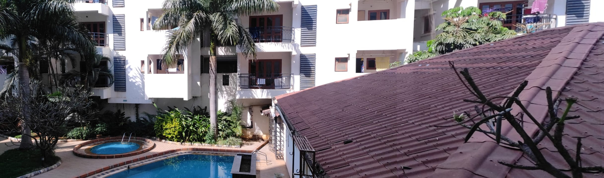
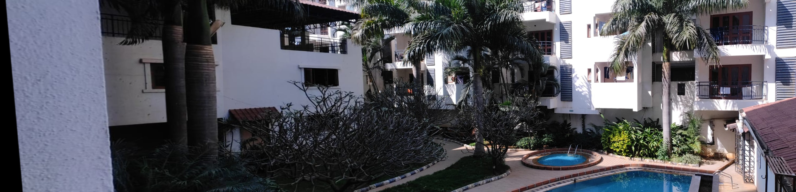
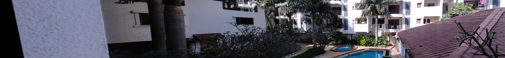
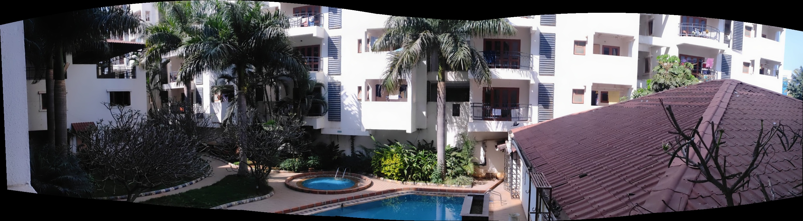

# VR Assignment 1 - Archis Kulkarni - MT2024082

## Overview
This repository contains the Python implementations for **Coin Detection and Segmentation** and **Panorama Creation** as part of the Visual Recognition assignment.

## Repository Structure
```
master branch/
|Assignment1
    |inputImages
    |outputImages
    │-- Assignment1.py
|Assignment2
    |inputImages
    |outputImages
    │-- Assignment2.py
│-- README.md
```

---

## 1️⃣ Coin Detection and Segmentation
### **Description**
The script `Assignment1.py` detects and segments and counts no of coins from input images. It applies **edge detection, thresholding, and contour filtering** to isolate coins from the background.

### **How to Run**
```bash
cd Assignment1
python Assignment1.py
```

### **Methods Used**
- **Preprocessing:** Image resizing, Gaussian Blur
- **Edge Detection:** Sobel Operator
- **Thresholding:** Otsu’s Binarization
- **Contour Detection:** Finding countours and filtering based on area
- **Output:** Detected coins are outlined and counted

### **Example Output**
Gradients:
_gradient.jpg)

Thresholding for contour:
_binary.jpg)

Detected coins :
_contours.jpg)

---

## 2️⃣ Panorama Creation
### **Description**
The script `Assignment2.py` stitches multiple overlapping images to generate a panorama using **feature matching and homography transformation**.

### **How to Run**
```bash
cd Assignment2
python Assignment2.py
```

### **Methods Used**
- **Feature Detection:** SIFT
- **Feature Matching:** Description matcher and knn based filtering
- **Homography Computation:** RANSAC
- **Image Warping & Blending:** Perspective Transform

### **Example Output**
Multi-stitching approach

Generated right panorama from input images:


Generated left panorama from input images:


Final panorama from left and right panoramas:


Ideal panorama using opnCV's inbuilt stitcher:

---

### **Required Libraries**
```
numpy
opencv-python
os
```

---

## **Observations & Results**
- The **coin detection algorithm successfully isolates coins** but may require fine-tuning of area thresholds for different images.
- It fails for overlapping coins and may detect internal coin features(used area filtering to counter this).
- The **panorama stitching works well** for images with sufficient overlap but may distort if misaligned images are used.
- The panorama suffers from skewing as images are stitched successively. Cylindrical projection can be used.
- The final outputs are saved in the `outputImages/` folder.

---

## **Notes**
- All input images should be placed in the respective `inputImages/` folder.
- The scripts are designed to run **without manual intervention**.
- If any issues arise, ensure the dependencies are correctly installed.

---

\* Generated with GPT and edited with 💖
